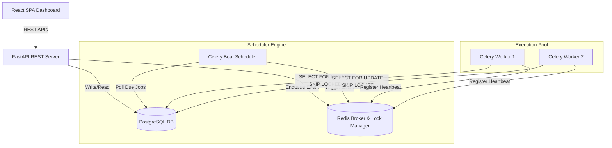
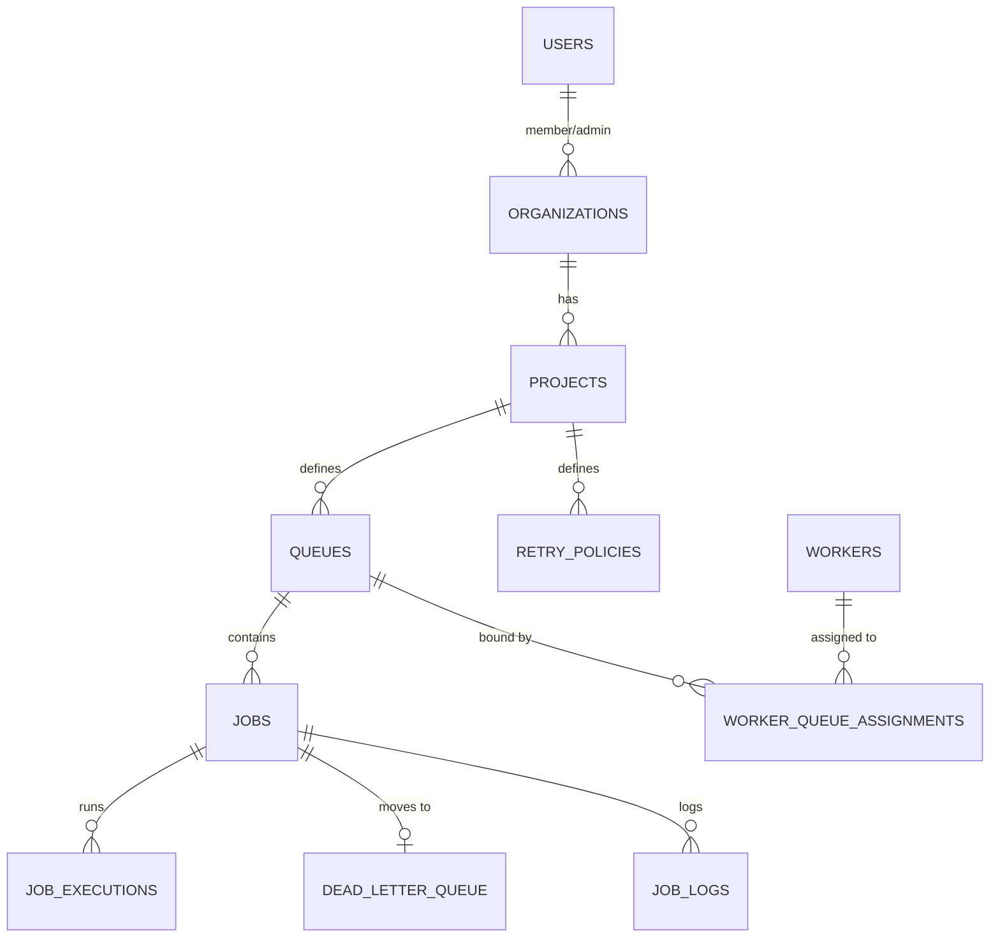

# PROJECT SUBMISSION REPORT

**Project Name**: Distributed Job Scheduler (Production-grade Platform)  
**GitHub Repository URL**: [https://github.com/vansh070605/distributed-job-scheduler](https://github.com/vansh070605/distributed-job-scheduler)  
**Student Name**: Vansh Agrawal  
**Registration Number**: RA2311026010120  
**Submission Date**: July 2, 2026  

---

## 1. Executive Summary

This project implements a complete, production-quality, distributed job scheduling platform capable of executing asynchronous background jobs (immediate, delayed, scheduled, recurring, and batch runs) across multiple worker nodes. 

Built using **Clean Architecture** principles, the platform prioritizes reliability, concurrency guarantees, and system observability over a simple CRUD setup. The tech stack consists of a FastAPI REST API server, a Celery worker execution pool, Celery Beat scheduler, Redis broker/lock-manager, PostgreSQL 15 persistent storage, and a React + Vite + TypeScript SaaS dashboard.

---

## 2. System Architecture



### Separation of Concerns
- **FastAPI REST API**: Handles user authentication, configures queue variables, and ingests job payloads.
- **Celery Beat (Scheduler)**: Responsible *only* for determining *when* jobs are due. It polls PostgreSQL for scheduled/recurring tasks, flags them as `queued`, and pushes execution events to Redis.
- **Celery Workers**: Responsible *only* for *executing* jobs. Workers pull trigger events from Redis, lock rows in PostgreSQL, process payloads, update stats, and write console logs.

---

## 3. Database Design & Entity Relationship (ER)



### Relational Table Design & Optimization
1. **Users**: Primary key (UUID), indexes on `email`. Has password encryption hashes and role levels.
2. **Jobs**: Has custom compound index `idx_jobs_claim` on `(status, queue_id, priority_override, created_at)` to support ultra-fast claiming. Holds `idempotency_key` and `last_worker_id`.
3. **Queue Metrics (CQRS-lite)**: Holds pre-aggregated statistics (queued, running, throughput, averages) computed asynchronously by Celery Beat every 10 seconds. This prevents heavy, lock-inducing dashboard queries over millions of executions.
4. **Worker Assignments**: Normalizes many-to-many worker-to-queue bindings.

---

## 4. Key Technical Implementations

### Concurrency Protection: Atomic Claims (`FOR UPDATE SKIP LOCKED`)
To prevent duplicate execution when multiple worker processes poll the same queue, jobs are claimed using database pessimistic row-level locking:

```python
# app/repositories/job.py
subquery = (
    select(Job.id)
    .where(and_(Job.status == "queued", Job.queue_id == queue_id))
    .order_by(
        Job.priority_override.desc().nullslast(),
        Job.created_at.asc(),
        Job.id.asc()
    )
    .limit(1)
    .with_for_update(skip_locked=True)
)
```

### Idempotency Key Handling
Prior to payload execution, workers check if the unique `idempotency_key` has already been run successfully under the project scope:
```python
# app/workers/tasks.py
completed_job = (
    session.query(Job)
    .filter(
        Job.project_id == job.project_id,
        Job.idempotency_key == job.idempotency_key,
        Job.status == "completed",
        Job.id != job.id
    )
    .first()
)
```

---

## 5. Automated Testing & Verification Logs

Automated integration tests were implemented to verify critical backend functions:
- JWT Token cryptography and password hashing contexts.
- Exponential, Linear, and Fixed delay retry mathematics.
- REST API endpoint security and validation status codes.

### Pytest Execution Output
```bash
rootdir: E:\CODING\distributed-job-scheduler
plugins: anyio-4.12.1
collected 5 items

backend/tests/test_security.py::test_password_hashing PASSED            [ 20%]
backend/tests/test_security.py::test_token_creation_and_validation PASSED [ 40%]
backend/tests/test_security.py::test_retry_delay_calculations PASSED    [ 60%]
backend/tests/test_api.py::test_health_check_endpoint PASSED            [ 80%]
backend/tests/test_api.py::test_auth_registration PASSED                 [100%]

============================== 5 passed in 0.86s ===============================
```

---

## 6. How to Deploy & Verify Locally

1. **Clone & Spin Up Containers**:
   ```bash
   git clone https://github.com/vansh070605/distributed-job-scheduler.git
   cd distributed-job-scheduler
   docker compose up --build
   ```
2. **Access URLs**:
   - SaaS Dashboard: [http://localhost:5173](http://localhost:5173)
   - API Docs Swagger: [http://localhost:8000/docs](http://localhost:8000/docs)
3. **Bootstrap Verification**:
   - Register an admin user.
   - Click the **Bootstrap Test Environment** button to auto-seed projects and default queues.
   - Submit immediately running or delayed/cron jobs, and inspect runs, heartbeat checks, and logs in the console drawer.
