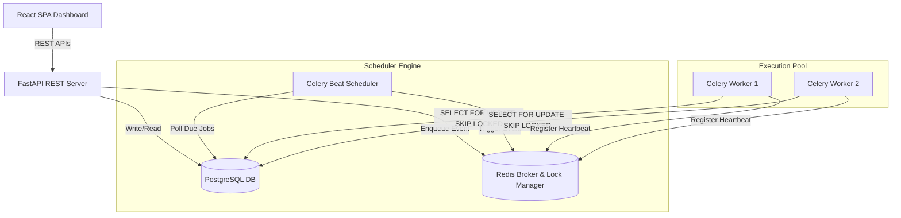
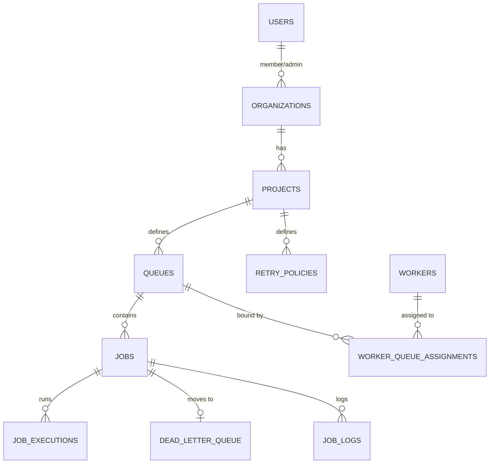

# Distributed Job Scheduler

A complete, production-quality, distributed job scheduler built using Clean Architecture principles. It features real-time worker tracking, queue priority control, automatic backoff retries, dead letter queue management, and a high-fidelity SaaS management dashboard.

---

## Technical Stack

- **REST API Server**: FastAPI, Pydantic, SQLAlchemy 2.0 (Async/Sync engine support)
- **Background Worker & Schedulers**: Celery & Celery Beat
- **Message Broker & Locks**: Redis
- **Database Storage**: PostgreSQL 15 + Alembic Database Migrations
- **SaaS Console Dashboard**: React 18, Vite, TypeScript, TailwindCSS, React Query, Recharts, Axios
- **Deployments**: Docker & Docker Compose

---

## Core System Architecture



---

## Entity Relationship (ER) Diagram



---

## Features Showcase

- **Separate Scheduler & Worker Concerns**: Schedulers identify *when* tasks run; Workers process *how*.
- **Atomic Claiming Algorithm**: Utilizes PostgreSQL `SELECT ... FOR UPDATE SKIP LOCKED` pessimistic locking to prevent duplicate execution across workers.
- **Idempotency checks**: Detects repeated triggers via `idempotency_key` headers.
- **Worker Heartbeats**: Active workers register keys in Redis. Celery Beat periodically flags crashed instances offline and re-enqueues running tasks.
- **Fast pre-aggregated stats**: Reading metrics does not lock heavy logs tables. Stats are computed asynchronously and written to cached tables.

---

## Folder Structure

```
├── backend/
│   ├── app/
│   │   ├── api/             # HTTP endpoints (v1 routes, dependencies)
│   │   ├── core/            # Config, security, database configuration, logger
│   │   ├── db/              # Base class, Session maker, Alembic environment
│   │   ├── middleware/      # Logging middleware, request-id, rate-limiter
│   │   ├── models/          # SQLAlchemy model definitions
│   │   ├── repositories/    # Database Repository pattern implementation
│   │   ├── schemas/         # Pydantic validation schemas
│   │   ├── scheduler/       # Cron Parsing, Job Queueing Engine
│   │   ├── services/        # Orchestrators and Business Logic
│   │   ├── workers/         # Celery task definitions, execution wrapper
│   │   └── main.py          # Entrypoint for FastAPI app
│   ├── tests/               # Pytest tests for API, logic, DB
│   ├── alembic/             # Database migrations
│   ├── Dockerfile
│   └── requirements.txt
├── frontend/
│   ├── src/
│   │   ├── components/      # Common UI parts (Sidebar, Layout)
│   │   ├── context/         # AuthContext
│   │   ├── pages/           # Page routes (Dashboard, Jobs, Workers, Queues, DLQ)
│   │   ├── services/        # Axios API clients
│   │   ├── App.tsx
│   │   └── main.tsx
│   ├── tailwind.config.js
│   ├── vite.config.ts
│   ├── package.json
│   └── Dockerfile
├── docker-compose.yml
└── README.md
```

---

## Quick Start (Docker Compose)

Run the entire suite of services using a single command:

```bash
docker compose up --build
```

### Port Configuration:
- **FastAPI REST API Server**: [http://localhost:8000/docs](http://localhost:8000/docs)
- **SaaS Console Dashboard**: [http://localhost:5173](http://localhost:5173)

For detailed installation options, refer to the [Setup Guide](docs/setup.md).

---

## Additional Documentation

Detailed architectural deep-dives are available in the `docs/` folder:
- [Architecture Guide](docs/architecture.md)
- [Design Decisions & Trade-offs](docs/design-decisions.md)
- [REST API Reference](docs/api.md)
- [Testing & Validation](docs/testing.md)
- [Production Deployment recommendations](docs/deployment.md)
- [Performance Tuning](docs/performance.md)
- [Security Architecture](docs/security.md)
