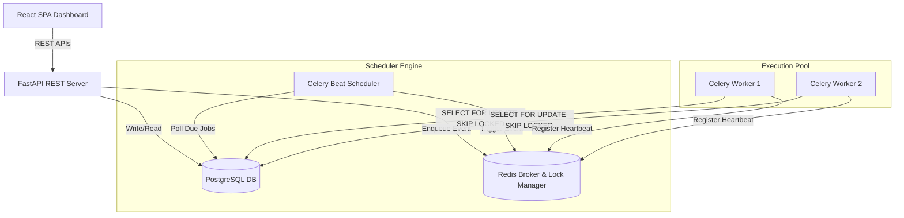
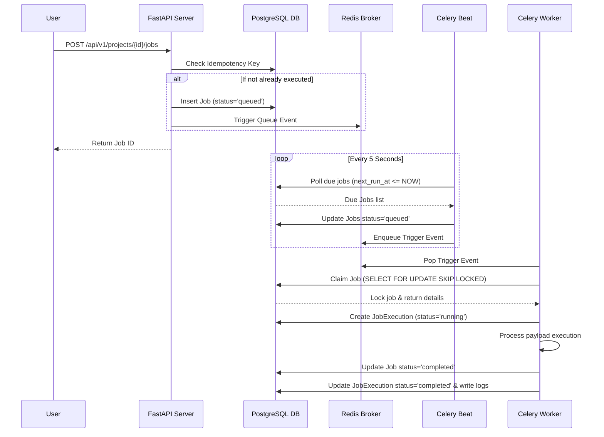

# System Architecture Guide

This document describes the high-level architecture, event flows, and database interactions of the Distributed Job Scheduler.

## System Topology

## Core Components

### 1. Stateless API Layer (FastAPI)
- Handles authentication and security enforcement.
- Performs REST API inputs validation via Pydantic schemas.
- Coordinates database operations via the Repository pattern.
- Issues trigger signals to Redis to kick off execution runs on the worker pool.

### 2. Scheduler Engine (Celery Beat)
- Orchestrates cron scheduling, delays, and recurring trigger loops.
- Scans Postgres database table records periodically to find jobs whose `next_run_at <= NOW()`.
- Transitions jobs from `scheduled` to `queued` state and enqueues event payloads in Redis.
- Monitors active nodes and reaps dead/offline worker processes.

### 3. Worker Execution Pool (Celery Workers)
- Thread-safe pool of worker processes.
- Atomically selects next available job from assigned queues using row-level locks.
- Validates job execution rules (e.g. idempotency keys).
- Logs execution logs and updates status columns in PostgreSQL.

---

## Event Sequences

